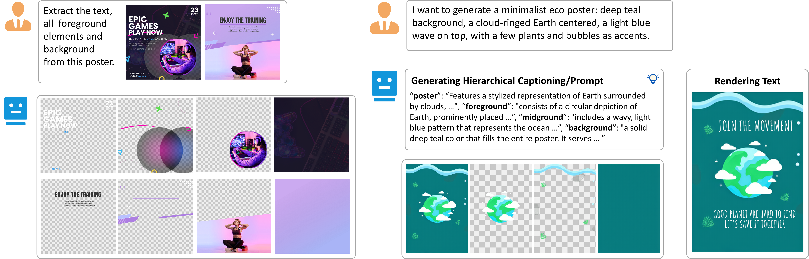

# OmniPSD

## OmniPSD: Layered PSD Generation with Diffusion Transformer.

**[Yiren Song](https://scholar.google.com.hk/citations?user=L2YS0jgAAAAJ)**<sup>1</sup>, **[Cheng Liu](https://scholar.google.com.hk/citations?hl=zh-CN&user=TvdVuAYAAAAJ)**<sup>1</sup>, **[Haofan Wang](https://haofanwang.github.io/)**<sup>2</sup>, **[Mike Zheng Shou](https://scholar.google.com/citations?user=S7bGBmkyNtEC)**<sup>1</sup>.

<sup>1</sup>[Show Lab](https://sites.google.com/view/showlab), National University of Singapore <sup>2</sup>[Lovart AI](https://www.lovart.ai/)  




## Citation

If you find OmniPSD useful, please cite:

```
@article{Liu2025OmniPSD,
  title         = {OmniPSD: Layered PSD Generation with Diffusion Transformer},
  author        = {Liu, Cheng and Song, Yiren and Wang, Haofan and Shou, Mike Zheng},
  journal       = {arXiv preprint arXiv:2512.09247},
  year          = {2025},
  archivePrefix = {arXiv},
  eprint        = {2512.09247},
  primaryClass  = {cs.CV},
  doi           = {10.48550/arXiv.2512.09247},
  url           = {https://arxiv.org/abs/2512.09247}
}
```

