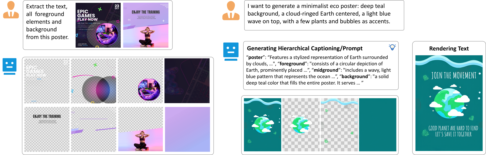

# OmniPSD

## OmniPSD: Layered PSD Generation with Diffusion Transformer

**[Yiren Song](https://scholar.google.com.hk/citations?user=L2YS0jgAAAAJ)**<sup>1</sup>, **[Cheng Liu](https://scholar.google.com.hk/citations?hl=zh-CN&user=TvdVuAYAAAAJ)**<sup>1</sup>, **[Haofan Wang](https://haofanwang.github.io/)**<sup>2</sup>, **[Mike Zheng Shou](https://scholar.google.com/citations?user=S7bGBmkyNtEC)**<sup>1</sup>

<sup>1</sup>[Show Lab](https://sites.google.com/view/showlab), National University of Singapore &nbsp; <sup>2</sup>[Lovart AI](https://www.lovart.ai/)

[[Paper]](https://arxiv.org/abs/2512.09247) &nbsp; [[Dataset]](https://huggingface.co/datasets/lc03lc/OmniPSD_Layered_Poster)



---

## Overview

OmniPSD is a unified diffusion-transformer framework for **bidirectional conversion** between raster images and editable PSD files with full transparency support. It addresses two tasks:

- **Text-to-PSD**: generates a layered PSD design (background, content layers, text layers) from a text description in a single forward pass, using a 2×2 spatial grid to capture inter-layer relationships.
- **Image-to-PSD**: decomposes a flat poster image into editable layers via an iterative extract-erase pipeline driven by Flux-Kontext.

Key components:
- **RGBA-VAE** — a transparency-preserving VAE that encodes/decodes RGBA images.
- **Flux-Dev LoRA** — fine-tuned for Text-to-PSD generation (4-panel grid layout).
- **Flux-Kontext LoRA ×4** — separate expert models for foreground/background extraction of content and text layers.

---

## Dataset

A subset of our layered poster dataset is available on Hugging Face:

**[lc03lc/OmniPSD_Layered_Poster](https://huggingface.co/datasets/lc03lc/OmniPSD_Layered_Poster)**

---

## Setup

```bash
git clone https://github.com/showlab/OmniPSD.git
cd OmniPSD
pip install -r requirements.txt
```

Base models required:
- [FLUX.1-dev](https://huggingface.co/black-forest-labs/FLUX.1-dev) — for Text-to-PSD training and inference
- [FLUX.1-Kontext-dev](https://huggingface.co/black-forest-labs/FLUX.1-Kontext-dev) — for Image-to-PSD training
- RGBA-VAE weights (FLUX.1-dev-alpha) — replace `/PATH/TO/RGBA_VAE/` in scripts

---

## Training

All scripts are run from the OmniPSD root directory. Edit the `PATH` placeholders in each script before running.

### Text-to-PSD

```bash
bash scripts/train_psd_flux.sh
```

Uses Flux-Dev with the RGBA-VAE. Training data is a 4-panel grid of `[full poster | content layer | background | text-removed poster]`.

### Image-to-PSD — Content Layers

```bash
# Foreground extraction
bash scripts/train_psd_content_front.sh

# Background inpainting
bash scripts/train_psd_content_back.sh
```

### Image-to-PSD — Text Layers

```bash
# Foreground extraction
bash scripts/train_psd_text_front.sh

# Background inpainting
bash scripts/train_psd_text_back.sh
```

All Kontext-based scripts take `(image, control)` pairs where `control` is the input poster used as conditioning.

---

## Inference

Edit `inference/infer_psd_flux.py` to set `INPUT_TXT_DIR`, `OUTPUT_ROOT`, `LORA_PATH`, and the RGBA-VAE path, then run:

```bash
cd /PATH/TO/OmniPSD
CUDA_VISIBLE_DEVICES=0 PYTHONPATH=$(pwd) python inference/infer_psd_flux.py
```

Each `.txt` file in `INPUT_TXT_DIR` is treated as one prompt. The script runs `NUM_PASSES` times per prompt with incrementing seeds and saves results under `OUTPUT_ROOT/<stem>/`.

---

## Citation

If you find OmniPSD useful, please cite:

```bibtex
@article{Liu2025OmniPSD,
  title         = {OmniPSD: Layered PSD Generation with Diffusion Transformer},
  author        = {Liu, Cheng and Song, Yiren and Wang, Haofan and Shou, Mike Zheng},
  journal       = {arXiv preprint arXiv:2512.09247},
  year          = {2025},
  archivePrefix = {arXiv},
  eprint        = {2512.09247},
  primaryClass  = {cs.CV},
  doi           = {10.48550/arXiv.2512.09247},
  url           = {https://arxiv.org/abs/2512.09247}
}
```
